# Habit Tracker
***
A simple habit tracker that allows you to track your habits 
and analyze them to see how well you're doing.

## Table of Contents
***
-[Why is the Habit Tracker beneficial?](#Why-is-the-habit-tracker-beneficial)

-[What can the Habit Tracker do?](#What-can-the-habit-tracker-do)

-[System Requirements](#System-Requirements)

-[Installation](#Installation)

-[How to use the Habit Tracker:](#How-to-use-the-habit-tracker)

-[How to use Test Data and Pytest](#How-to-use-Test-Data-and-Pytest)


## Why is the Habit Tracker beneficial?
***

The Habit Tracker is a beneficial lifestyle application, 
because it can help to implement positive lifestyle changes that are important to the user.

Psychologically, the user is motivated to continue their habits, so they don't BREAK 
their longest streak.

## What can the Habit Tracker do?
***

Functionality
***

The Habit Tracker can log habits:

- Create a habit
- Delete a habit
- Complete a check-off event for a habit
- View a list of all habits
- View a list of daily habits
- View a list of weekly habits
- Reset a habit by deleting all previous check-off events and select a new start date


The Habit Tracker can analyze habits:

  - Calculate Current Streak per habit
  - Calculate Longest Streak per habit
  - Total of check-off events in a month per habit
  - Habit with the longest streak


## System Requirements
***

- Python 3.10 +

## Installation
***
Once Python is installed, you will also need to install the following packages
using the commandline. 

- Questionary
``````commandline
pip install questionary
``````

- Pytest
``````commandline
pip install pytest
``````


## How to use the Habit Tracker:
***

1. Open the terminal of your preferred IDE (Integrated Development Environment) or command line. 
(For reference I used Pycharm)

2. Navigate to the directory where the Habit Tracker is located.

3. Run the Habit Tracker by typing the following command in the terminal:

``````commandline
python main.py
``````

4. Use the Habit Tracker by selecting which option you would like to use from the main menu. 

Note: You can select an option using the arrow keys on your keyboard and pressing enter to select the option
you want to use.

5. Follow the prompts to complete the action you have selected. 

**-Main Menu:**

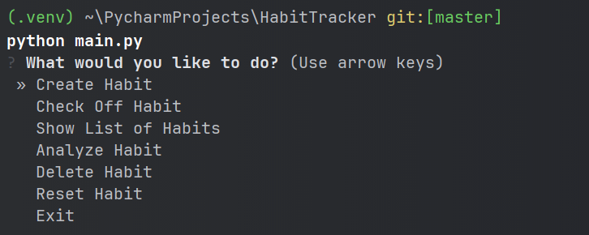

**- Create Habit**

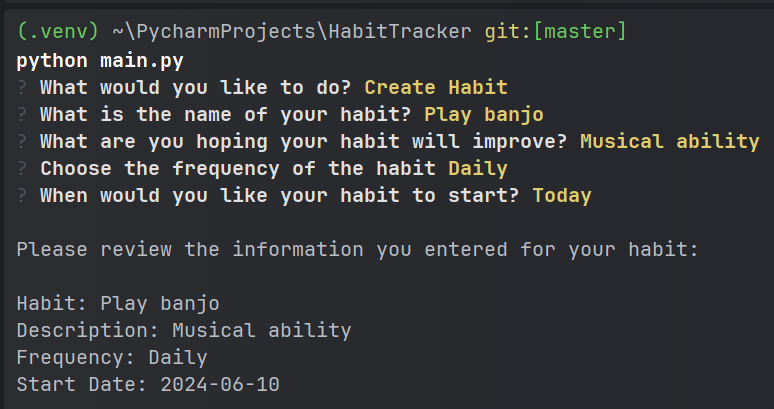

**- Check Off Habit**

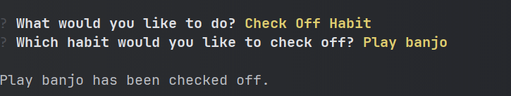

Note: For habit consistency the check-off event is only available for the current date. This does not allow the user
to go back in time and complete a check-off event for a previous date. (This is only allowed with the test data.)

**- Show List of Habits**

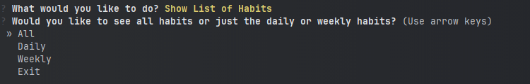

All:

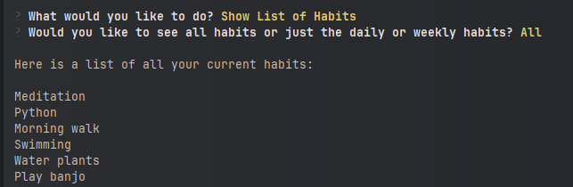

Daily:

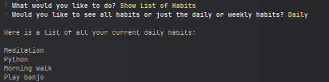


Weekly:

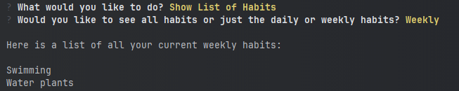


**- Analyze Habit**

Longest Streak of All Habits:

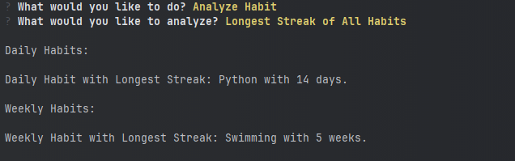

Check-off Events for a Specific Month:

Enter a value from 1-12 that corresponds to the month you would like to analyze.

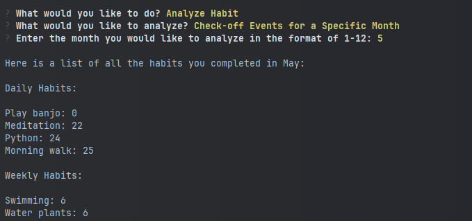

Note: This function allows the user to see the total number of check-off events for each individual habit being tracked
for a specific month. (If the habit was not tracked at the time, the total will be 0 for that habit.) 

The habits are in ascending order, so the user can see which habit they struggled with the most for any given month.

Current Streak for a Habit: 

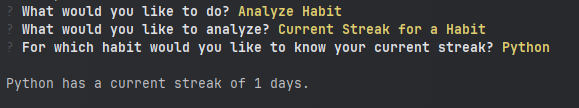

Longest streak for a Habit:

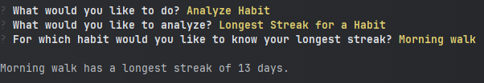

**- Delete Habit**
Select the habit you would like to delete from the list: 
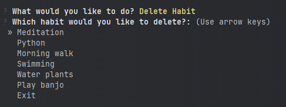

The habit will then be deleted from the CLI and the database.

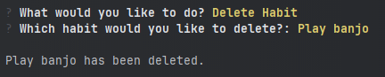

**- Reset Habit**

Resetting the habit allows the user to delete all previous check-off events and select a new start date for the habit.
This is useful if the user has not been using the Habit Tracker for an extended period of time, but they are still 
working on improving that habit. 

They may want to reset all the data to get a more accurate representation of their progress.

There are 3 options for resetting the habit: 

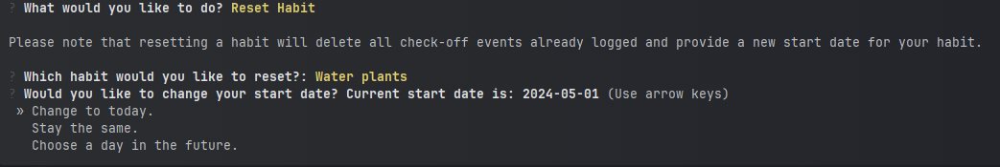

Note: The user is notified of the current start date for reference to inform their decision of how to modify their
start date.

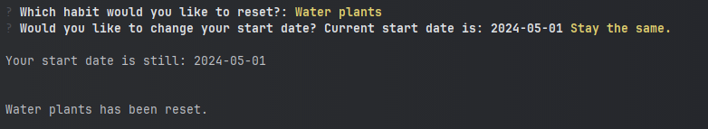

**- Exit**

The exit function in the Main Menu allows the user to close the Habit Tracker.

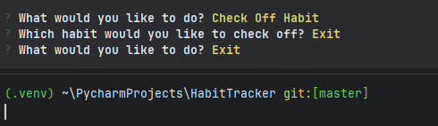

Otherwise, the option to Exit throughout the Habit Tracker in all other menus will return the user to the main menu.

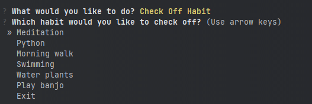


## How to use Test Data and Pytest

1. Open the terminal of your preferred IDE (Integrated Development Environment) or command line.
2. Navigate to the directory where the Habit Tracker is located.
3. Make sure the habit.py file has the database set to--> **Database = "test.db"**
3. Run pytest by typing the following command in the terminal:

``````commandline   
pytest.exe
``````

Note: The test data used is in the file conftest.py. The conftest.py includes all test fixtures including:

-5 predefined habits (3 daily and 2 weekly)

-4 weeks of check-off events for all 5 habits

This file should be stored in the same folder as the test file:
test_habit.py.

4. Currently, after running Pytest all tests should pass. However, the last two methods are skipped which delete the
data in the database (the teardown method for some reason does not delete the test.db file from the directory). 

Note: These two methods are skipped to allow the user to interact with the data from the test.db file while running the
main.py file.  This will allow the user to test the functionality of the Habit Tracker.

5. If you would like to run pytest again, I would recommend manually deleting the test.db file. 

To delete the test.db file manually, type the following command in the terminal:

``````commandline   
del .\test.db
``````
6. Then comment out the two fixture notes @pytest.mark.skip in the test_habit.py file. This allows the last two methods
to run and delete all the data in the test.db file, instead of skipping these last two methods.


